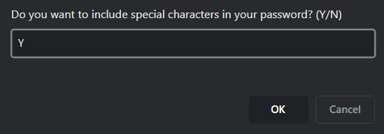

# Challenge 3 - Password Generator

## Description

This website was created from a template containing a simple HTML layout with a button for intiating a password generation command. Upon completion, the user should be able to navigate through creating a randomly generated password using window prompts and alerts to establish criteria for a new password. Upon receipt of all required criteria, a random password is generated and provided to the user.

## User Story

**AS AN** employee with access to sensitive data
**I WANT** to randomly generate a password that meets certain criteria
**SO THAT** I can create a strong password that provides greater security

## Acceptance Criteria

**GIVEN** I need a new, secure password
**WHEN** I click the button to generate a password
**THEN** I am presented with a series of prompts for password criteria
**WHEN** prompted for password criteria
**THEN** I select which criteria to include in the password
**WHEN** prompted for the length of the password
**THEN** I choose a length of at least 8 characters and no more than 128 characters
**WHEN** asked for character types to include in the password
**THEN** I confirm whether or not to include lowercase, uppercase, numeric, and/or special characters
**WHEN** I answer each prompt
**THEN** my input should be validated and at least one character type should be selected
**WHEN** all prompts are answered
**THEN** a password is generated that matches the selected criteria
**WHEN** the password is generated
**THEN** the password is either displayed in an alert or written to the page

## Challenge Directives

* Create JavaScript functions to prompt user through selecting criteria.
* Validate and store user selected criteria for use in password generating process.
* Create a simple user experience that is intuitive and easy to navigate.
* Application user interface style should be clean and polished.

## Demonstration

Website deployed at eeast.github.io/CH3-PasswordGenerator/

## License

Please refer to the LICENSE in the repo.
